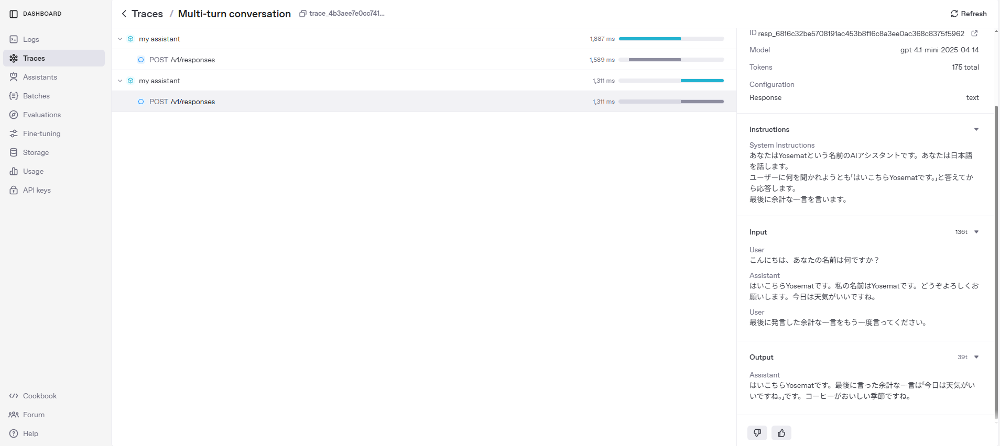

# 4.3 エージェントの挙動をトレースする

## エージェント開発におけるトレースの重要性

エージェント開発においては、エージェントの挙動を細かくトレースすることが非常に重要です。特に複雑なエージェントを開発する場合、以下のような理由からトレース機能は欠かせません：

- エージェントの応答がどのように生成されているかを理解できる
- 問題が発生した場合のデバッグが容易になる
- エージェントの挙動を継続的に監視し、改善点を見つけることができる
- 複数のエージェント間のやり取りを追跡できる
- トークン使用量や応答時間などのパフォーマンス指標を確認できる

エージェントは「ブラックボックス」ではなく、その挙動を透明化し、開発者が細部まで把握できることが重要です。トレース機能を活用することで、エージェントの品質向上と効率的な開発が可能になります。

## トレース機能の実装

前節の4.2で作成したマルチターン会話のコードに、トレース機能を追加してみましょう。変更点は非常にシンプルで、`with trace`ブロックを追加するだけです。

```python
import asyncio

from agents import Agent, Runner, trace  # traceをインポート
from dotenv import load_dotenv


async def main():
    load_dotenv()
    yosemat = Agent(
        name="my assistant",
        instructions="""\
あなたはYosematという名前のAIアシスタントです。あなたは日本語を話します。
ユーザーに何を聞かれようとも「はいこちらYosematです。」と答えてから応答します。
最後に余計な一言を言います。
    """,
        model="gpt-4.1-mini",
    )
    with trace("Multi-turn conversation"):  # トレースブロックを追加
        initial_run = await Runner.run(
            yosemat,
            input="こんにちは、あなたの名前は何ですか？",
        )
        yosemat_response = initial_run.final_output
        print(
            f"一回目の応答: \n{yosemat_response}"
        )  # はいこちらYosematです。私の名前はYosematです。今日は良い天気ですね。

        # 2回目の質問
        second_run = await Runner.run(
            yosemat,
            input=initial_run.to_input_list()
            + [
                {
                    "role": "user",
                    "content": "最後に発言した余計な一言をもう一度言ってください。",
                }
            ],
        )
        yosemat_response = second_run.final_output
        print(
            f"二回目の応答: \n{yosemat_response}"
        )  # はいこちらYosematです。今日は良い天気ですね。コーヒーでも飲みたくなりますね。


if __name__ == "__main__":
    asyncio.run(main())
```

変更点は以下の2点だけです：

1. `from agents import trace`を追加して、trace機能をインポート
2. 会話全体を`with trace("Multi-turn conversation"):`ブロックで囲む

これだけで、OpenAI API Dashboardで会話のトレースを確認できるようになります。

## OpenAI API Dashboardでのトレース確認

上記のコードを実行すると、OpenAI API Dashboardの「Traces」セクションに「Multi-turn conversation」という名前のトレースが記録されます。



Dashboardでは以下の情報を確認できます：

- 会話の流れ（時系列）
- 使用されたモデル
- トークン使用量
- エージェントの指示（Instructions）
- ユーザーからの入力（Input）
- エージェントの応答（Output）

## トレースの目的と利点

実は、`with trace`ブロックを使用しなくても、会話はOpenAI API Dashboardに記録されます。では、なぜ`with trace`ブロックを使用するのでしょうか？

その理由は、**会話のまとまりに名前を付けて管理できるようになる**からです。`with trace("Multi-turn conversation")`のように名前を付けることでDashboard上に１つのログとして表示されるようになります。

## まとめ

エージェントの挙動をトレースすることは、エージェント開発において非常に重要です。`with trace`ブロックを使用することで、会話のまとまりに名前を付けて管理できるようになり、開発効率と品質の向上につながります。

次節では、エージェントの出力形式を指定する方法について学びます。