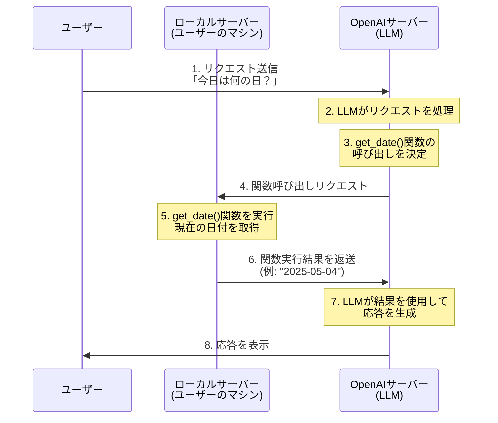

# 5.1 エージェントにツールを与える

前章では、エージェントの基本的な作成方法や会話の進め方について学びました。本章では、エージェントの能力を大幅に拡張する「ツール」について学んでいきます。

## エージェントとは何か？

OpenAIの[A practical guide to building agents](https://cdn.openai.com/business-guides-and-resources/a-practical-guide-to-building-agents.pdf)では、エージェントを次のように定義しています：

> Applications that integrate LLMs but don't use them to control workflow execution—think simple chatbots, single-turn LLMs, or sentiment classifiers—are not agents

つまり、単純なチャットボットや単一ターンのLLM、感情分析器のような決まりきった制御フローを持つものはエージェントではないのです。エージェントの真の強みは、**自らどのようなアクションを取るべきかを高度な推論能力に基づいて決定できる**点にあります。これがこれまでのAIと大きく異なる点です。

そして、エージェントが取るアクションの具体的な形が「ツール」です。ツールを使うことで、エージェントは単なるテキスト生成を超えた能力を獲得します。

## 最初のツール付きエージェント

それでは、最初のツール付きエージェントを作成してみましょう。以下のコード例を見てください：

```python
import asyncio

from agents import Agent, Runner, function_tool


@function_tool
def get_date() -> str:
    """
    Returns the current date in YYYY-MM-DD format.
    """
    from datetime import datetime

    return datetime.now().strftime("%Y-%m-%d")


agent = Agent(
    name="Date Assistant",
    instructions="""\
あなたは「今日は何の日」エージェントです。
ユーザーが「今日は何の日」と聞くと今日の日付とその日付に関連する歴史的なイベントを返します。
""",
    model="gpt-4.1-nano",
    tools=[get_date],
)


async def main():
    # ユーザーからの質問
    user_input = "今日は何の日？"
    response = await Runner.run(agent, input=user_input)
    print(response.final_output)


if __name__ == "__main__":
    asyncio.run(main())
```

このコードでは、以下のことを行っています：

1. `@function_tool`デコレータを使って、`get_date()`関数をツールとして定義しています。
2. この関数は現在の日付をYYYY-MM-DD形式で返します。
3. エージェントを作成し、名前、指示、モデル、そして**ツールのリスト**を指定しています。
4. エージェントは「今日は何の日」と聞かれると、`get_date()`ツールを使って今日の日付を取得し、その日に関連する歴史的なイベントを返すように指示されています。

## ツールの定義方法

ツールを定義する最も簡単な方法は、`@function_tool`デコレータを使用することです。このデコレータは、Pythonの関数をエージェントが使用できるツールに変換します。

```python
@function_tool
def get_date() -> str:
    """
    Returns the current date in YYYY-MM-DD format.
    """
    from datetime import datetime

    return datetime.now().strftime("%Y-%m-%d")
```

ここで重要なのは、関数のドキュメント文字列（docstring）と型ヒントです。エージェントはこれらの情報を使って、ツールの目的と使い方を理解します。適切なドキュメントと型ヒントを提供することで、エージェントはツールをより効果的に使用できるようになります。

## エージェントへのツールの提供

定義したツールをエージェントに提供するには、`Agent`クラスの`tools`パラメータにツールのリストを渡します：

```python
agent = Agent(
    name="Date Assistant",
    instructions="""\
あなたは「今日は何の日」エージェントです。
ユーザーが「今日は何の日」と聞くと今日の日付とその日付に関連する歴史的なイベントを返します。
""",
    model="gpt-4.1-nano",
    tools=[get_date],
)
```

これにより、エージェントは`get_date`ツールを使用できるようになります。エージェントは指示に基づいて、適切なタイミングでこのツールを呼び出すことができます。

## エージェントの実行

ツールを持つエージェントの実行方法は、前章で学んだ基本的なエージェントと同じです：

```python
async def main():
    # ユーザーからの質問
    user_input = "今日は何の日？"
    response = await Runner.run(agent, input=user_input)
    print(response.final_output)
```

ユーザーが「今日は何の日？」と質問すると、エージェントは自動的に`get_date()`ツールを呼び出して今日の日付を取得し、その日に関連する歴史的なイベントを返します。

## ツール実行の内部ワークフロー

エージェントがツールを使用する際の内部ワークフローを理解することは重要です。以下に、「今日は何の日？」というユーザーのリクエストから応答が返されるまでの流れを説明します：

1. ユーザーが「今日は何の日？」というリクエストを送信します
2. リクエストはOpenAIのサーバーに送られ、LLMがそれを処理します
3. LLMは指示とリクエストを分析し、`get_date()`関数を呼び出す必要があると判断します
4. OpenAIのサーバーは関数呼び出しのリクエストをローカルサーバー（ユーザーのマシン）に送信します
5. ローカルサーバーで`get_date()`関数が実行され、現在の日付が取得されます
6. 関数の実行結果（日付文字列）がローカルサーバーからOpenAIのサーバーに返送されます
7. OpenAIのサーバーでLLMが関数の結果を受け取り、それを使用して応答を生成します
8. 生成された応答がユーザーに表示されます

このワークフローを図で表すと以下のようになります：



このように、ツールを使用するエージェントでは、OpenAIのサーバーとローカルサーバー（ユーザーのマシン）の間で通信が行われます。LLMはOpenAIのサーバー上で動作し、関数の実行はローカルサーバーで行われます。この分散処理により、LLMの推論能力とローカルマシンの実行能力を組み合わせた強力なシステムが実現されています。


次のセクションでは、よりWebSearchToolの使い方について学んでいきましょう。