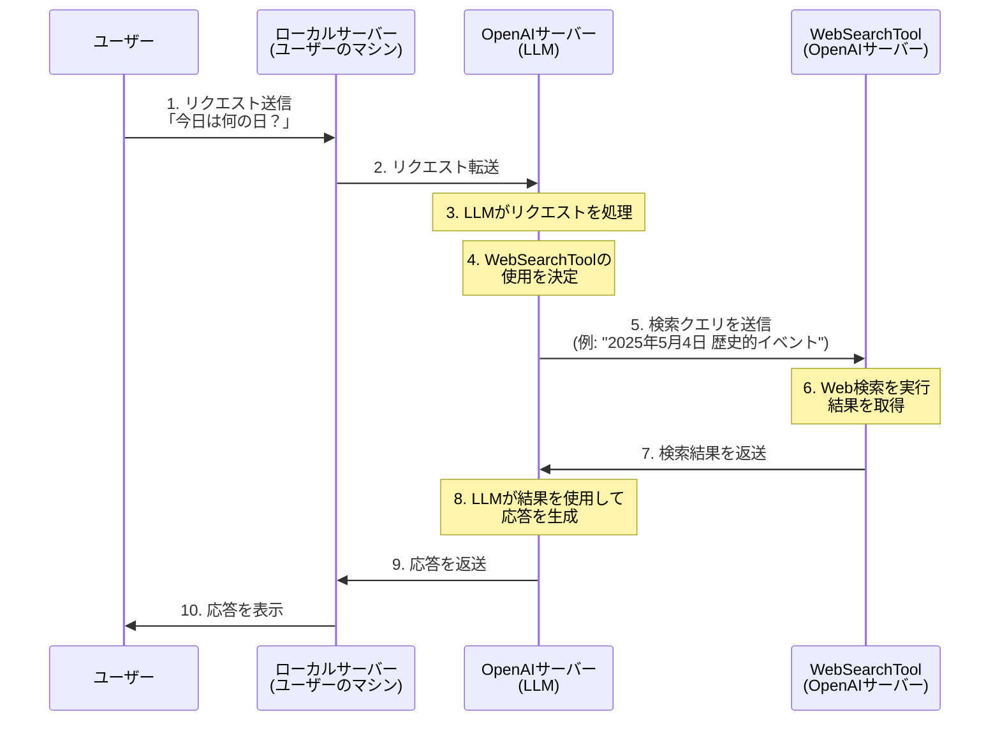

# 5.2 WebSearchToolを使う

前節では、ローカルで実行される関数ツールについて学びました。本節では、OpenAIのサーバー上で実行される「Hosted Tool」の一つである「WebSearchTool」について学んでいきます。

## WebSearchToolとは

WebSearchToolは、OpenAIが提供するHosted Toolの一つで、その名の通りWeb検索を行うためのツールです。このツールを使用することで、エージェントはインターネット上の最新情報にアクセスし、ユーザーの質問に対してより正確で最新の回答を提供できるようになります。

WebSearchToolの主な特徴は以下の通りです：

1. **最新情報へのアクセス**: LLMの学習データ以降の最新情報を取得できます
2. **事実確認**: 回答の正確性を向上させるために、情報源を確認できます
3. **詳細な情報**: 特定のトピックについて、より詳細な情報を提供できます
4. **コスト**: 他のツールに比べて割高で、一回の実行あたり約5円程度かかります

## WebSearchToolを使ったエージェントの作成

それでは、WebSearchToolを使ったエージェントを作成してみましょう。以下のコード例を見てください：

```python
import asyncio

from agents import Agent, Runner, WebSearchTool, function_tool


@function_tool
def get_date() -> str:
    """
    Returns the current date in YYYY-MM-DD format.
    """
    from datetime import datetime

    return datetime.now().strftime("%Y-%m-%d")


agent = Agent(
    name="Date Assistant",
    instructions="""\
あなたは「今日は何の日」エージェントです。
ユーザーが「今日は何の日」と聞くと今日の日付とその日付に関連する歴史的なイベントを返します。
""",
    model="gpt-4.1",
    tools=[get_date, WebSearchTool()],
)


async def main():
    # ユーザーからの質問
    user_input = "今日は何の日？"
    response = await Runner.run(agent, input=user_input)
    print(response.final_output)


if __name__ == "__main__":
    asyncio.run(main())
```

このコードでは、前節で作成したエージェントに`WebSearchTool()`を追加しています。これにより、エージェントは日付を取得するだけでなく、その日に関連する歴史的なイベントをWeb検索で調べることができるようになります。

なお、モデルが`gpt-4.1-nano`から`gpt-4.1`に変更されているのは記事執筆時点で`gpt-4.1-nano`がWebSearchToolをサポートしていないためです。

## Hosted Toolの実行ライフサイクル

WebSearchToolのようなOpenAI公式のHosted Toolは、前節で学んだ関数ツールとは異なる実行ライフサイクルを持っています。以下に、WebSearchToolを使用する際のワークフローを説明します：

1. ユーザーが「今日は何の日？」というリクエストを送信します
2. リクエストはOpenAIのサーバーに送られ、LLMがそれを処理します
3. LLMは指示とリクエストを分析し、WebSearchToolを使用する必要があると判断します
4. LLMはWebSearchToolの呼び出しパラメータ（検索クエリなど）を決定します
5. WebSearchToolの実行はOpenAIのサーバー上で行われます（ローカルサーバーには戻りません）
6. OpenAIのサーバー上でWeb検索が実行され、結果が取得されます
7. 検索結果はLLMに直接渡され、LLMがそれを使用して応答を生成します
8. 生成された応答がユーザーに表示されます

このワークフローを図で表すと以下のようになります：



## 関数ツールとHosted Toolの違い

関数ツールとHosted Toolの主な違いは以下の通りです：

1. **実行場所**:
   - 関数ツール: ローカルサーバー（ユーザーのマシン）で実行
   - Hosted Tool: OpenAIのサーバー上で実行

2. **制御フロー**:
   - 関数ツール: LLMがツールの使用を決定→ローカルサーバーに制御が移る→結果がOpenAIに返される
   - Hosted Tool: LLMがツールの使用を決定→OpenAIサーバー内でツールが実行される→結果がLLMに直接渡される

3. **コスト**:
   - 関数ツール: 基本的に追加コストなし（ローカルリソースを使用）
   - Hosted Tool: 追加コストあり（WebSearchToolの場合、約5円/実行）

4. **利点**:
   - 関数ツール: カスタマイズ性が高く、ローカルリソースやAPIにアクセス可能
   - Hosted Tool: 設定が簡単で、OpenAIが管理するインフラを利用できる

## まとめ

WebSearchToolを含むHosted Toolは、エージェントの能力を大幅に拡張する強力な機能です。特に、最新の情報が必要な場合や、LLMの知識だけでは不十分な場合に非常に有用です。

ただし、コストが高いため、使用する際は必要性を十分に検討することが重要です。また、関数ツールとHosted Toolを適切に組み合わせることで、より柔軟で強力なエージェントを構築することができます。
