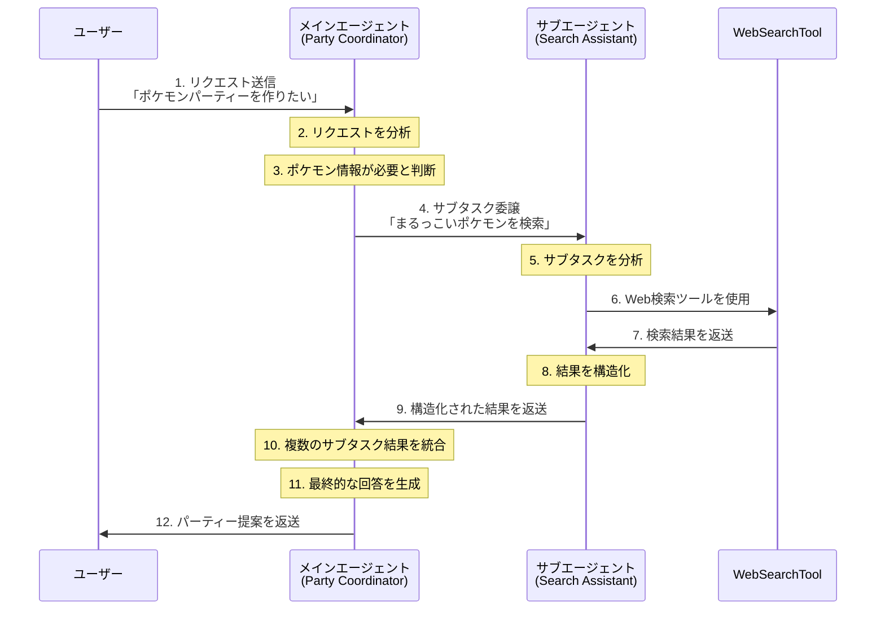

# 5.3 エージェントをツールとして使う

前節までで、関数ツールとHosted Toolについて学びました。本節では、さらに高度なデザインパターンである「エージェントをツールとして使う」（Agents as Tools）について学んでいきます。

## エージェントをツールとして使うとは

「エージェントをツールとして使う」とは、あるエージェントが別のエージェントをツールとして利用し、サブタスクを委譲するデザインパターンです。このパターンを使うことで、複雑なタスクを小さなサブタスクに分割し、それぞれを専門のエージェントに任せることができます。

これは人間の組織と似ています。例えば、会社のCEOは全体の戦略を考えますが、具体的な業務は各部門の専門家に委譲します。同様に、メインのエージェントは全体のタスクを管理し、特定の専門知識が必要なサブタスクを他のエージェントに委譲します。

## マルチエージェントシステムの利点

エージェントをツールとして使うマルチエージェントシステムには、以下のような利点があります：

1. **集中力の向上**：
   人間と同じく、AIにも「集中力」があります。入力コンテキストが長ければ長いほど、AIのリソースが「何に集中すべきか」に余分に割かれることになります。この結果、精度の低下という形でコストを支払うことになります。複雑なタスクを細かく分割し、まだ「頭がフレッシュな」エージェントにサブタスクを委譲することで、全体の精度を向上させることができます。

2. **コストの削減**：
   出力がたった一言だとしても、入力が長いと高いAPI利用料が課されます。長い会話を継続していると、会話の範囲が広がるにつれて利用料が高くなっていきます。タスクを分割して入力コンテキストを短くすることで、同じ出力量に対するコストを抑えることが可能な場合があります。

3. **専門性の活用**：
   各エージェントが特定の領域に特化することで、より高品質な結果を得ることができます。

4. **並列処理**：
   サブタスクを複数のエージェントに同時に委譲することで、時間のかかるLLMの処理を並列化できる可能性があります。

## エージェントをツールとして使う例

以下のコード例を見てみましょう。このコードでは、ポケモンパーティーを提案するシステムを構築しています：

```python
import asyncio

from agents import Agent, Runner, WebSearchTool
from pydantic import BaseModel


class PokemonCandidate(BaseModel):
    name: str
    description: str


class PokemonSearchResult(BaseModel):
    candidates: list[PokemonCandidate]


class Pokemon(BaseModel):
    name: str
    type: str
    abilities: list[str]


class PokemonParty(BaseModel):
    description: str
    members: list[Pokemon]


search_agent = Agent(
    name="Pokemon Search Assistant",
    instructions="""\
あなたはポケモン検索エージェントです。
ユーザーがポケモンに関するリクエストをすると、ポケモンの候補を返します。
必ずポケモンはスカーレットバイオレットのポケモンを使用してください。
""",
    model="gpt-4.1",
    tools=[WebSearchTool()],
    output_type=PokemonSearchResult,
)

party_coordinator = Agent(
    name="Party Coordinator",
    instructions="""\
あなたはポケモンパーティーコーディネーターです。
ユーザーがポケモンのパーティーに関するリクエストをすると、ポケモンのパーティーを提案します。
ポケモンはスカーレットバイオレットのポケモンを使用してください。ポケモンの詳細情報に関しては、ポケモン検索エージェントを使用してください。
""",
    model="gpt-4.1",
    tools=[
        search_agent.as_tool(
            tool_name="pokemon_search",
            tool_description="ポケモンの候補を検索するエージェント",
        )
    ],
)


async def main():
    # ユーザーからの質問
    user_input = "まるっこいポケモン１匹、水タイプのかっこいいポケモン１匹、最新の伝説のポケモン１匹を含む６匹のパーティーを作りたいなあ。"
    response = await Runner.run(party_coordinator, input=user_input)
    print(response.final_output)


if __name__ == "__main__":
    asyncio.run(main())
```

このコードでは、以下のことを行っています：

1. **データモデルの定義**：
   Pydanticを使用して、ポケモン候補、検索結果、ポケモン、パーティーのデータモデルを定義しています。

2. **検索エージェントの作成**：
   `search_agent`は、WebSearchToolを使用してポケモンの情報を検索するエージェントです。出力タイプとして`PokemonSearchResult`を指定しています。

3. **パーティーコーディネーターの作成**：
   `party_coordinator`は、ユーザーの要望に基づいてポケモンパーティーを提案するエージェントです。ここで重要なのは、`search_agent`をツールとして使用している点です：
   ```python
   tools=[
       search_agent.as_tool(
           tool_name="pokemon_search",
           tool_description="ポケモンの候補を検索するエージェント",
       )
   ]
   ```
   `.as_tool()`メソッドを使用することで、エージェントをツールとして登録しています。

4. **実行**：
   ユーザーからの入力に対して`party_coordinator`を実行し、結果を表示しています。

## エージェントをツールとして使う際のワークフロー

エージェントをツールとして使用する際のワークフローを図で表すと以下のようになります：



このワークフローでは、メインエージェント（Party Coordinator）がタスク全体を管理し、必要に応じてサブエージェント（Search Assistant）にサブタスクを委譲しています。サブエージェントは自身のツール（WebSearchTool）を使用してタスクを完了し、結果をメインエージェントに返します。

## タスク設計は難しい
人間にとってもそうであるように他のエージェントにとって適切なタスクを設計することは簡単ではありません。もしあなたがサブタスクの粒度や入出力について考えがあるのであれば、それをシステムプロンプトに含めたり、サブタスクの入力やゴールとなる出力の形状を定義するべきです。

これらが適切でなければマルチエージェントシステムによるタスク分割は機能しないでしょう。例えば委譲されるタスクが大きすぎると委譲の意味がなくなり、小さすぎるとオーバーヘッドが大きくなります。設計したタスクの責任範囲は親・子それぞれに適切に指示する必要もあります。ゴール設定が曖昧であればエージェントは思った通りのサブタスクの成果を提出してくれないでしょう。上のコード例ではサブエージェントに`output_type`を定義するなどによってこの問題を緩和しています。

## まとめ

「エージェントをツールとして使う」デザインパターンは、複雑なタスクを効率的に処理するための強力な手法です。このパターンを使うことで、集中力の向上、コストの削減、専門性の活用などの利点を得ることができます。

ただし、適切なタスク粒度の設計や入出力の形状定義など、設計上の課題もあります。これらの課題に適切に対処することで、より効果的なマルチエージェントシステムを構築することができます。
